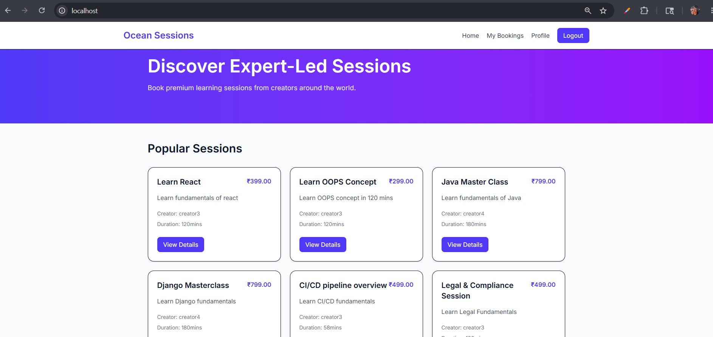
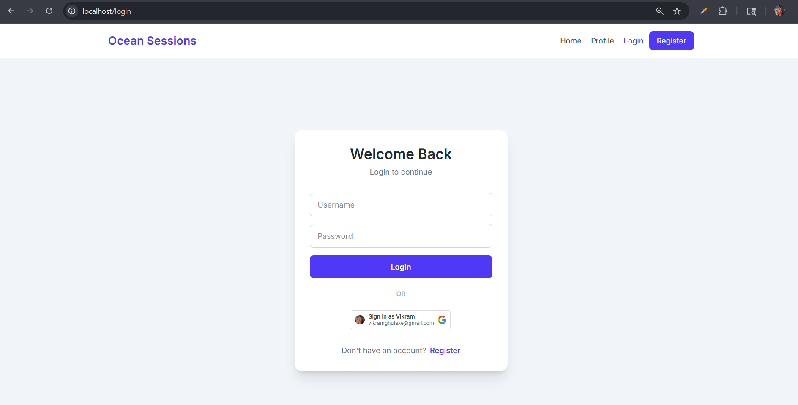
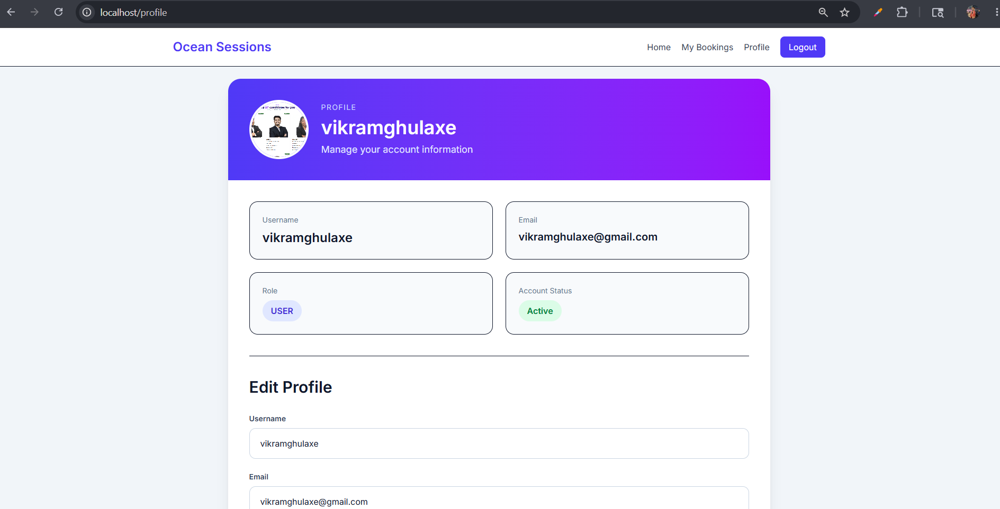
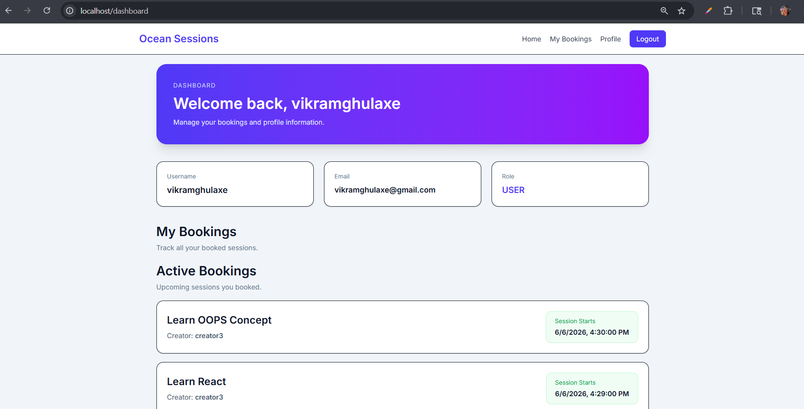
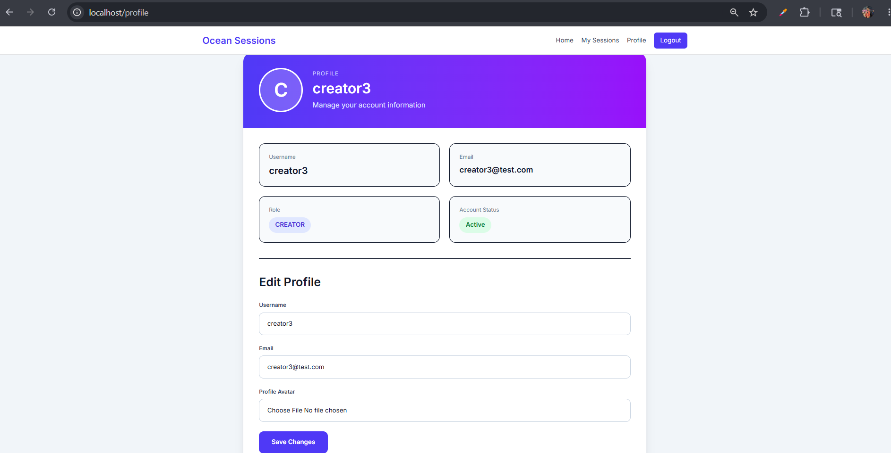
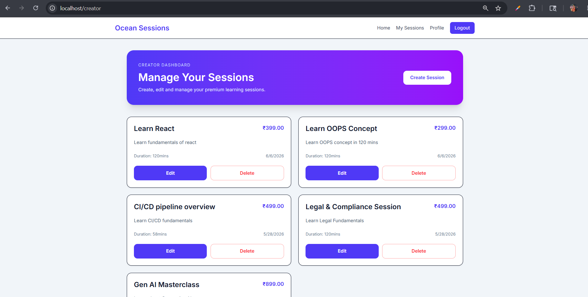

# Ocean Sessions Marketplace

A full-stack sessions marketplace platform built as part of the Ocean Across Full-Stack Developer Assignment.

The platform allows users to browse and book learning sessions while creators can create and manage their own sessions.

---

# Features

## Authentication & Authorization

* Google OAuth authentication
* JWT-based authentication
* Role-based access control
* User and Creator roles
* Protected routes
* Profile management
* Avatar upload support

---

## Sessions & Booking

* Public session catalog
* Session detail page
* Session booking flow
* Active & past bookings
* Creator session management
* Edit/Delete sessions
* Booking dashboards

---

## Frontend Features

* Responsive modern UI
* Tailwind CSS styling
* Loading states
* Form validations
* Toast notifications
* Role-based navigation
* Avatar/profile management

---

## Backend Features

* Django REST Framework APIs
* JWT Authentication
* OAuth token verification
* PostgreSQL integration
* Media uploads
* RESTful architecture

---

# Tech Stack

## Frontend

* React
* TypeScript
* Tailwind CSS
* Axios
* React Router
* React Hot Toast

## Backend

* Django
* Django REST Framework
* Simple JWT
* PostgreSQL

## Infrastructure

* Docker
* Docker Compose
* Nginx Reverse Proxy

---

# Project Structure

```bash
project-root/
│
├── frontend/
├── backend/
├── nginx/
├── docker-compose.yml
├── .env.example
└── README.md
```

---

# Setup Instructions

## 1. Clone Repository

```bash
git clone <repository-url>

cd project-root
```

---

## 2. Create Environment File

Create:

```bash
.env
```

using:

```env
DB_NAME=ocean
DB_USER=postgres
DB_PASSWORD=password
DB_HOST=postgres
DB_PORT=5432

SECRET_KEY=your_secret_key

GOOGLE_CLIENT_ID=your_google_client_id

VITE_GOOGLE_CLIENT_ID=your_google_client_id
```

---

## Demo Accounts

### Creator
Username: creator_demo
Password: Password123

### User
Username: user_demo
Password: Password123

---

# Google OAuth Setup

## Create OAuth Credentials

1. Go to Google Cloud Console
2. Create a project
3. Configure OAuth Consent Screen
4. Create OAuth Client ID
5. Add authorized origin:

```txt
http://localhost
```

6. Copy the client ID into:

```env
GOOGLE_CLIENT_ID=
VITE_GOOGLE_CLIENT_ID=
```

---

# Run Project

Start the entire application:

```bash
docker-compose up --build
```

---

# Application URLs

| Service     | URL                     |
| ----------- | ----------------------- |
| Frontend    | http://localhost        |
| Backend API | http://localhost/api/   |
| Admin Panel | http://localhost/admin/ |

---

# Demo Flow

## User Flow

1. Register/Login
2. Browse sessions
3. View session details
4. Book a session
5. View active and past bookings
6. Update profile and avatar

---

## Creator Flow

1. Register as Creator
2. Login
3. Create sessions
4. Edit/Delete sessions
5. Manage creator dashboard

---

# Docker Architecture

The application uses a multi-container Docker architecture:

* Frontend Container (React)
* Backend Container (Django)
* PostgreSQL Database Container
* Nginx Reverse Proxy Container

All services run using Docker Compose.

---

# Environment Variables

## Backend

```env
DB_NAME=
DB_USER=
DB_PASSWORD=
DB_HOST=
DB_PORT=

SECRET_KEY=

GOOGLE_CLIENT_ID=
```

## Frontend

```env
VITE_GOOGLE_CLIENT_ID=
```

---

# Future Improvements

* Payment gateway integration
* Session search & filters
* Booking analytics
* Email notifications
* S3/MinIO storage
* Rate limiting improvements

---

# Screenshots

### Home Page


### Login Page


### Register Page


### Profile Page


### Bookings Dashboard


### Creator Profile


### Creator Dashboard


### Creator Session


---

# Author

Vikram Ghulaxe
